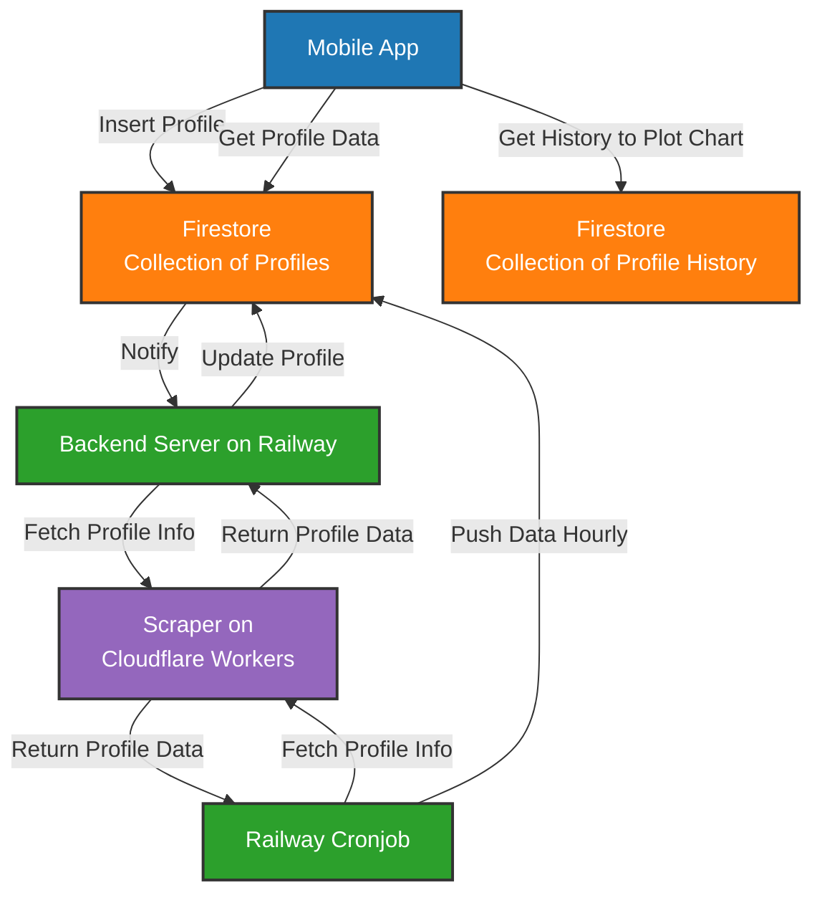

# Folo

```mermaid
graph TD
    %% Define style for main components
    classDef appStyle fill:#1f77b4,stroke:#333,stroke-width:2px,color:#fff;
    classDef firestoreStyle fill:#ff7f0e,stroke:#333,stroke-width:2px,color:#fff;
    classDef serviceStyle fill:#2ca02c,stroke:#333,stroke-width:2px,color:#fff;
    classDef cronStyle fill:#d62728,stroke:#333,stroke-width:2px,color:#fff;
    classDef scrapperStyle fill:#9467bd,stroke:#333,stroke-width:2px,color:#fff;

    %% App interacting with Firestore
    app[Mobile App] --> |Insert Profile| profiles[Firestore <br> Collection of Profiles]
    app --> |Get Profile Data| profiles
    app --> |Get History to Plot Chart| history[Firestore <br> Collection of Profile History]

    %% Firestore notifying Backend
    profiles --> |Notify| backend[Backend Server on Railway]

    %% Backend fetching profile info
    backend --> |Fetch Profile Info| scrapper[Scraper on <br> Cloudflare Workers]
    scrapper --> |Return Profile Data| backend
    backend --> |Update Profile| profiles

    %% Cronjob pulling data from scraper and pushing to Firestore
    RailwayCron[Railway Cronjob] --> |Fetch Profile Info| scrapper
    RailwayCron --> |Push Data Hourly| profiles
    scrapper --> |Return Profile Data| RailwayCron

    %% Apply styles
    class app appStyle;
    class profiles,history firestoreStyle;
    class backend,RailwayCron serviceStyle;
    class scrapper scrapperStyle;
```
